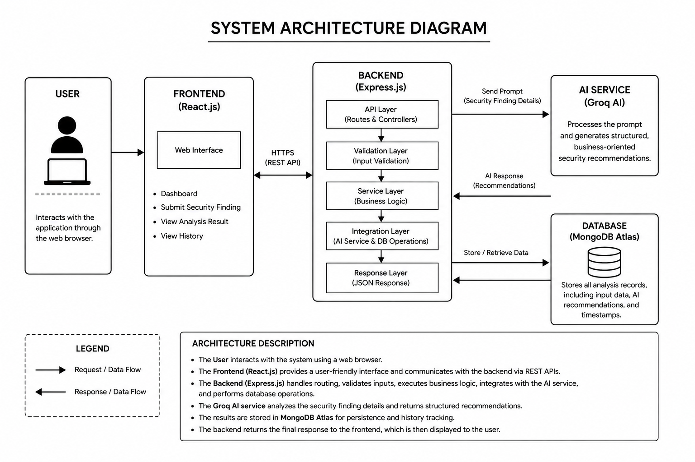

# AI-Powered Security Finding Analysis System

A production-grade full-stack MERN application that processes raw cybersecurity vulnerability findings and leverages Groq AI to generate structured, business-oriented risk reports and remediation instructions. 

This repository is submitted as the Backend Engineer Intern Technical Assignment for **AnantNetra Technologies**.

---

## Badges

[](https://react.dev/)
[](https://nodejs.org/)
[](https://expressjs.com/)
[](https://www.mongodb.com/cloud/atlas)
[](https://groq.com/)
[](https://tailwindcss.com/)
[](https://jestjs.io/)
[](https://opensource.org/licenses/MIT)

---

## Table of Contents

- [Project Overview](#project-overview)
- [Features](#features)
- [Tech Stack](#tech-stack)
- [Project Structure](#project-structure)
- [System Architecture](#system-architecture)
- [Screenshots](#screenshots)
- [Installation](#installation)
- [Environment Variables](#environment-variables)
- [API Overview](#api-overview)
- [Testing](#testing)
- [Documentation](#documentation)
- [Future Enhancements](#future-enhancements)
- [Author](#author)
- [License](#license)

---

## Project Overview

Organizations identify various technical security findings via automated scanners, penetration tests, and audits. However, translating technical issues (e.g., "Missing security headers" or "SQL Injection") into business risks and actionable remediation strategies remains a bottleneck.

The **AI-Powered Security Finding Analysis System** automates this lifecycle. A user submits a technical finding, impacted asset, and severity level via a web dashboard. The Express backend validates the input, constructs a prompt using custom risk models, queries the Groq AI API (`llama-3.1-8b-instant`), and returns structured business-oriented risk intelligence. The generated intelligence is saved directly in a MongoDB Atlas database, enabling security teams to query, track, and delete analysis records from a central ledger.

---

## Features

- **AI-Powered Security Finding Analysis**: Translates technical vulnerabilities into business-oriented risk indicators.
- **Groq AI Integration**: Employs the official Groq SDK in JSON mode to ensure structured, machine-readable output.
- **MongoDB Atlas Storage**: Stores raw input parameters alongside generated risk metrics for audits.
- **Analysis History**: Provides a searchable history ledger with expand/collapse toggles and record deletion.
- **RESTful APIs**: Exposes endpoints conforming to standard HTTP verbs and status codes.
- **Zod Validation**: Performs schema validations on input payloads before any controller operations.
- **Centralized Error Handling**: Standardizes response envelopes for HTTP status codes, validation bugs, database timeouts, and Groq rate limits.
- **Responsive UI**: A modern interface styled using Tailwind CSS v4, compatible with desktop, tablet, and mobile.
- **Jest Testing**: Integration tests powered by Jest and Supertest with mock interfaces.
- **Modular Architecture**: Clean separation between controllers, routing, configuration, utility wrappers, and Mongoose schemas.

---

## Tech Stack

| Component | Technology | Description |
| :--- | :--- | :--- |
| **Frontend** | React 19, Vite | Single-page framework with quick build cycles |
| **Styling** | Tailwind CSS v4 | Compile-time utility classes |
| **Backend** | Node.js, Express.js | Event-driven architecture with native ES Modules |
| **Database** | MongoDB Atlas, Mongoose | NoSQL database storage with ODM schema models |
| **AI Integration**| Groq SDK | Client query handler targeting `llama-3.1-8b-instant` |
| **Validation** | Zod | Runtime payload parsing and schema matching |
| **Testing** | Jest, Supertest | Unit and integration routing checks |
| **Deployment** | Vercel (UI), Render (Server) | Continuous deployment setups |

---

## Project Structure

```
AI-Powered-Security-Finding-Analysis-System/
├── backend/
│   ├── src/
│   │   ├── config/          # Client connectors (Database, Groq SDK)
│   │   ├── controllers/     # API request handler logic
│   │   ├── routes/          # REST route endpoint mappings
│   │   ├── models/          # Mongoose database models
│   │   ├── services/        # AI orchestration wrapper
│   │   ├── prompts/         # Core system and user prompt definitions
│   │   ├── middlewares/     # Validation, error handling, and 404 filters
│   │   ├── validators/      # Zod validation schemas
│   │   ├── utils/           # Winston logger, custom responses, and async handlers
│   │   ├── tests/           # Integration tests
│   │   ├── app.js           # Middleware setup
│   │   └── server.js        # Server listener entry
│   ├── .env.example
│   └── package.json
├── frontend/
│   ├── public/
│   ├── src/
│   │   ├── components/      # UI components (Navbar, Result Cards)
│   │   ├── pages/           # View panels (Dashboard, History, 404)
│   │   ├── services/        # Axios API fetch calls
│   │   ├── App.jsx          # Route declarations
│   │   └── main.jsx         # React bootstrapping entry script
│   ├── .env.example
│   ├── package.json
│   └── vite.config.js
├── .gitignore
└── README.md
```

- **`backend/`**: Implements the REST API server, data validation pipelines, Groq communication, database models, and unit test suites.
- **`frontend/`**: Implements the React user interface, page routing, and dashboard form panels.

---

## System Architecture



The application follows a **Three-Tier Architecture**:
1. **Presentation Layer (React 19)**: Captures user entries and renders risk metrics.
2. **Application Layer (Express.js)**: Runs CORS/rate-limiting security layers, validates inputs using Zod, queries the AI, and saves the outcome.
3. **Data Layer (MongoDB Atlas & Groq API)**: Houses the persistent database history and powers the threat model completions.

---

## Screenshots

- **Dashboard Panel**: `` *(Placeholder)*
- **AI Analysis Result**: `` *(Placeholder)*
- **Ledger History Page**: `` *(Placeholder)*
- **Jest Test Execution**: `` *(Placeholder)*

---

## Installation

### 1. Clone the Repository
```bash
git clone https://github.com/your-username/AI-Powered-Security-Finding-Analysis-System.git
cd AI-Powered-Security-Finding-Analysis-System
```

### 2. Configure and Run the Backend
1. Navigate to the backend workspace:
   ```bash
   cd backend
   ```
2. Install dependencies:
   ```bash
   npm install
   ```
3. Copy environment configuration file:
   ```bash
   cp .env.example .env
   ```
4. Update the `.env` file with your actual database and Groq credentials.
5. Start the backend server in development mode:
   ```bash
   npm run dev
   ```

### 3. Configure and Run the Frontend
1. Open a new terminal and navigate to the frontend workspace:
   ```bash
   cd ../frontend
   ```
2. Install dependencies:
   ```bash
   npm install
   ```
3. Start the Vite development server:
   ```bash
   npm run dev
   ```
4. Access the web interface at `http://localhost:5173`.

---

## Environment Variables

| Variable | Description | Example / Default Value |
| :--- | :--- | :--- |
| **`PORT`** | Port number the backend server listens on | `5000` |
| **`MONGODB_URI`** | MongoDB Atlas connection string | `mongodb+srv://<user>:<password>@cluster.mongodb.net/db` |
| **`GROQ_API_KEY`** | Secret key for Groq API authentication | `gsk_exampleSecretApiKeyGoesHere` |
| **`CORS_ORIGIN`** | Whitelisted origin URL allowed to trigger APIs | `http://localhost:5173` |
| **`NODE_ENV`** | Current server environment status | `development` |

---

## API Overview

| Method | Endpoint | Description |
| :--- | :--- | :--- |
| **`GET`** | `/api/v1/health` | Returns server health status |
| **`POST`** | `/api/v1/analyze` | Generates AI risk analysis and stores it in database |
| **`GET`** | `/api/v1/history` | Fetches previous security findings, sorted newest first |
| **`DELETE`** | `/api/v1/history/:id` | Deletes a specific finding record by ID |

---

## Testing

The backend includes integration tests written in **Jest** and **Supertest** to validate endpoints without making real network queries. The database models and Groq SDK chat completions are mocked using spies to allow isolated test executions.

### How to Run Tests
```bash
cd backend
npm test
```

`` *(Execution Screenshot Placeholder)*

---

## Documentation

Additional technical specifications are available in the **[docs/](file:///d:/ai-security-finding-analysis-system/docs)** directory:
- **Software Design Document**
- **System Architecture**
- **User Flow Chart**
- **Entity Relationship (ER) Diagram**

---

## Future Enhancements

- **JWT Authentication**: Secure endpoints behind JSON Web Tokens.
- **Role-Based Access Control (RBAC)**: Distinguish roles between analysts, managers, and administrators.
- **Audit Logging**: Maintain log metrics showing who analyzed or deleted specific findings.
- **Risk Score Calculation**: Dynamically calculate a numerical business risk score using CVSS vectors.
- **PDF Reports**: Export analysis results as PDF risk reports.
- **Analytics Dashboard**: Graph vulnerability distribution, severity clusters, and remediation metrics over time.

---


